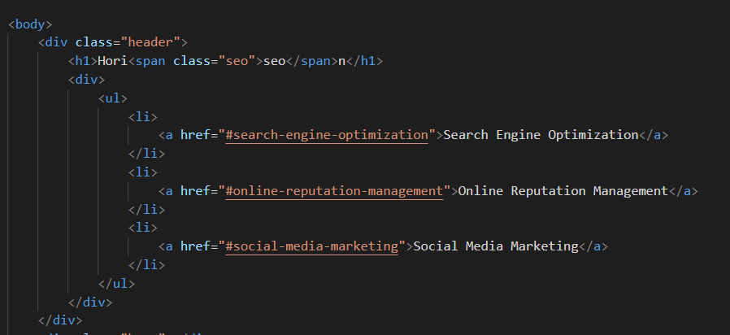
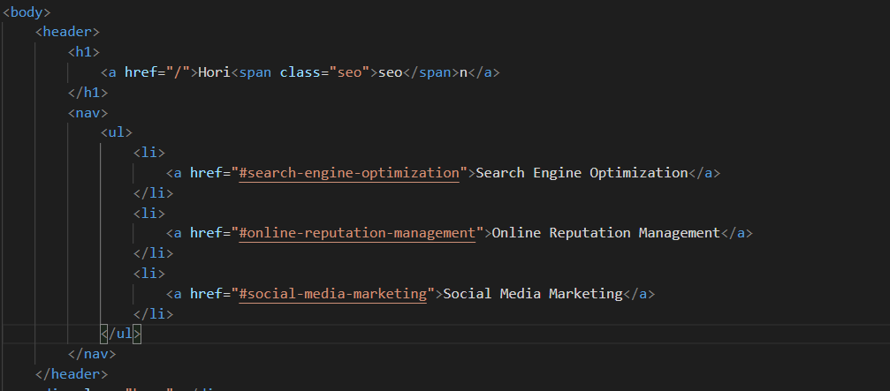
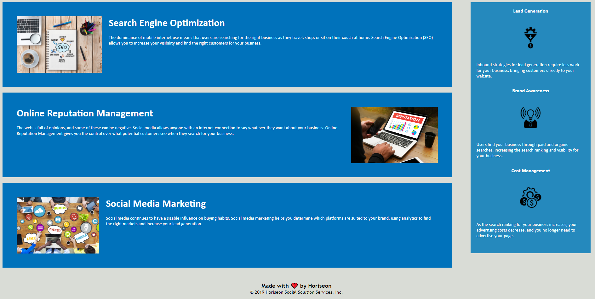

# Code Refactor Starter Code

### This is the link to the deployed application [horiseon-web-application](https://dkbaffour777.github.io/horiseon/.)

The aim of this project was to clean up an existing code by
adding semantic HTML elements where necessary, adding alt attributes
to image elements, make sure all links are working, consolidating
repeated code where necessary at the CSS rules, and many other best practices
with the aim of maintaining the visual aspect of the code as rendered
in a web browser and improving the quality and readability of the code.

The following images shows just a fraction of the code where improvements
were made:

- Bad HTML code
 

- Good HTML code
 
  
Below is a preview of the horiseon web application:

